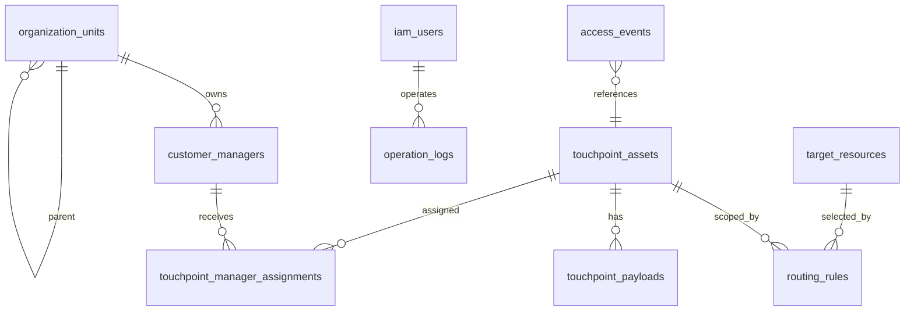

# 数据关系图

```mermaid
erDiagram
  organization_units ||--o{ organization_units : parent
  organization_units ||--o{ customer_managers : owns
  touchpoint_assets ||--o{ touchpoint_payloads : has
  touchpoint_assets ||--o{ touchpoint_manager_assignments : assigned
  customer_managers ||--o{ touchpoint_manager_assignments : receives
  target_resources ||--o{ routing_rules : selected_by
  touchpoint_assets ||--o{ routing_rules : scoped_by
  access_events }o--|| touchpoint_assets : references
  iam_users ||--o{ operation_logs : operates
```

逻辑外键由应用事务校验；历史快照不使用删除级联。
