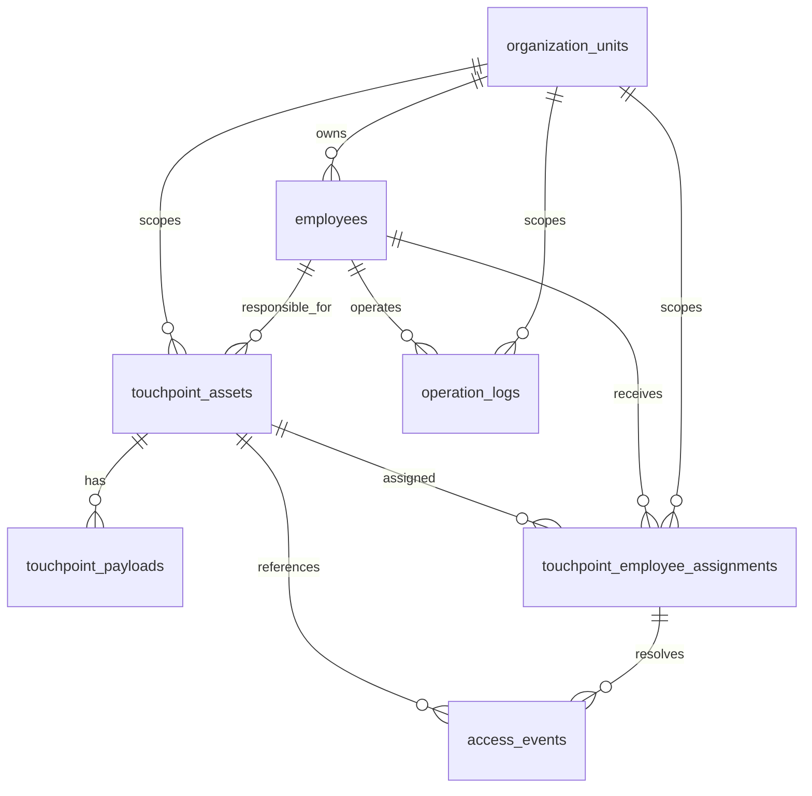

# V1.3.2 数据关系图

```mermaid
erDiagram
  organization_units ||--o{ employees : owns
  organization_units ||--o{ touchpoint_assets : scopes
  employees ||--o{ touchpoint_assets : responsible_for
  touchpoint_assets ||--o{ touchpoint_payloads : has
  touchpoint_assets ||--o{ touchpoint_employee_assignments : assigned
  employees ||--o{ touchpoint_employee_assignments : receives
  organization_units ||--o{ touchpoint_employee_assignments : scopes
  touchpoint_assets ||--o{ access_events : references
  touchpoint_employee_assignments ||--o{ access_events : resolves
  employees ||--o{ operation_logs : operates
  organization_units ||--o{ operation_logs : scopes
```

所有关系均为应用逻辑引用，不创建会破坏历史数据的级联删除。组织层级通过 `organization_units.org_code` 前缀解析，不保存父组织外键。

V1.3.2 不包含 `iam_*`、`target_resources` 或 `routing_rules`。
